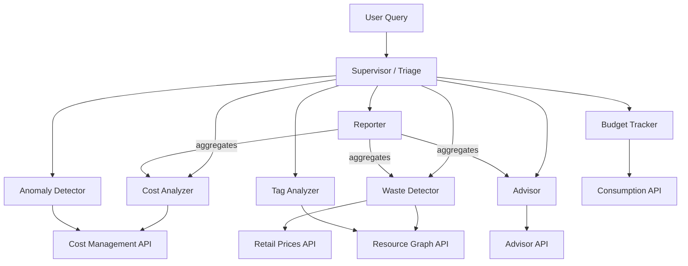

# Azure Cost Agent (LangGraph)


Multi-agent Azure cost analyzer built with LangGraph. 7 specialist agents, 22 tools, 35 resource types, real Azure API data with cost impact analysis. Uses `create_supervisor` + `create_agent` for routing and `MemorySaver` for multi-turn conversations.

## Architecture



## Agents

| Agent | Capabilities |
|-------|-------------|
| **Cost Analyzer** | Spend breakdowns, period comparisons, top spenders, CSV cost diff exports |
| **Waste Detector** | 35 resource types: idle VMs, orphaned disks/NICs/IPs/NSGs/route tables/private endpoints, oversized DBs, expensive always-on services (Cosmos DB, AKS, Firewall, Bastion, Redis) — with monthly cost per finding |
| **Advisor** | Azure Advisor cost recommendations sorted by impact, RI/SP coverage |
| **Anomaly Detector** | Daily cost spike detection against rolling baseline |
| **Budget Tracker** | Budget utilization, burn rate forecasting |
| **Tag Analyzer** | Untagged resources, tag coverage by type, missing tag key detection |
| **Reporter** | Aggregated optimization report with prioritized action plan |

## Example queries

- "What are my top 10 most expensive resources this month?"
- "Find all orphaned disks and public IPs with cost estimates"
- "Compare my spending over the last 30 days vs the previous 30 days"
- "Are there any cost anomalies in the last 2 weeks?"
- "Generate a full optimization report"
- "Which resources are missing the 'cost-center' tag?"
- "Show my budget utilization and forecast"

## Quick start

```bash
pip install uv && uv sync
cp .env.example .env   # fill in your values
az login
make chat              # opens Chainlit UI at http://localhost:8000
```

## RBAC requirements

The identity running the agent needs these roles on the target subscription(s):

| Role | Scope | Why |
|------|-------|-----|
| `Cost Management Reader` | Subscription | Cost queries, budget data |
| `Reader` | Subscription | Resource Graph queries, Advisor recommendations |
| `Cognitive Services OpenAI User` | AI Foundry resource | Model access |

## Configuration

| Variable | Default | Description |
|----------|---------|-------------|
| `AZURE_AI_PROJECT_ENDPOINT` | — | Azure OpenAI endpoint (required) |
| `AZURE_OPENAI_RESPONSES_DEPLOYMENT_NAME` | `gpt-4.1-mini` | Model deployment name |
| `AZURE_SUBSCRIPTION_IDS` | — | Comma-separated subscription IDs (required) |
| `COST_AGENT_ANOMALY_THRESHOLD` | `2.0` | Spike detection multiplier |
| `COST_AGENT_CPU_THRESHOLD` | `10.0` | VM underutilization CPU % |
| `COST_AGENT_QUERY_LIMIT` | `500` | Max resources per Resource Graph query |

## Deployment

See [infra/README.md](infra/README.md) for Terraform deployment to Azure Container Apps using Azure Verified Modules.

## Known limitations

- **Token-level streaming**: `create_supervisor` wraps agents as subgraphs — `stream_mode="messages"` returns complete messages, not token-by-token chunks ([langgraph-supervisor#226](https://github.com/langchain-ai/langgraph-supervisor-py/issues/226)).
- **In-memory state**: `MemorySaver` is lost on restart. For persistent multi-turn, use `PostgresSaver` or `SqliteSaver`.
- **No authentication**: The Chainlit UI has no built-in authentication. For production, configure [Chainlit auth](https://docs.chainlit.io/authentication/overview) or deploy behind Azure API Management / Entra ID.
- **PDF export**: Not implemented. `create_agent` sets `tool_choice=None` internally ([factory.py#L1373](https://github.com/langchain-ai/langchain/blob/master/libs/langchain_v1/langchain/agents/factory.py#L1373)), making it impossible to force specific tool calls with smaller models like GPT-4.1-mini. CSV export works reliably via the `export_cost_diff` tool.

## Development

```bash
make test       # pytest
make lint       # ruff check
make format     # ruff format
make check      # all of the above
```

## License

[MIT](LICENSE)
